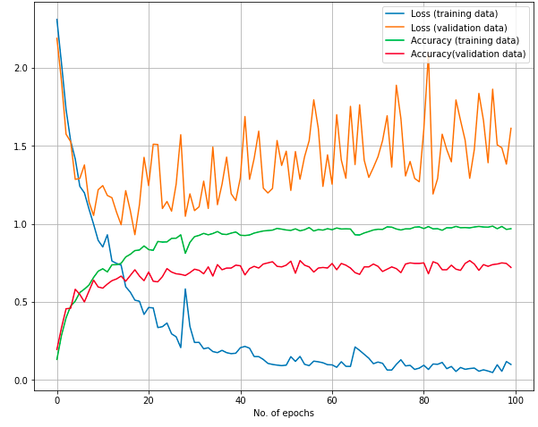

# CAN YOU NAME 3 MONKEY SPECIES?

## Introduction
Monkeys are often seen as being cute and highly intelligent animals. There are more than 260 different types of monkeys that have their own characteristics in terms of size, color, location, and even their abilities, But who can remember all 260 species? I can't. So, I decided to build a simple deep learning model from 10 different species that tells me what kind of monkey I am looking at. Purpose of this study is to gain insight into monkeys and appreciate humans' closest living relatives.

## Data
The data set, I have fed into my convolutional neural network came from kaggle (https://www.kaggle.com/slothkong/10-monkey-species). I just want to take a moment and thank all the people who has contributed to this dataset and making it more accessible.

## Workflow
### Let's start with my first model

  
  

I have used 4 convolutional layers and two dense layers in my first model and ran it for 100 epochs. Validation loss and training loss get diverged as the model continue to learn predicting training data. This is a sign of overfitting. After a certain point, model start getting good at predicting training data but not the validation data. Final test accuracy was at 72 after 100 epochs and quite promising. In the next model, I focus on regularizing my model to prevent overfitting. 

### Second model

  
  

I have reduced the learning rate from .001 to .0001, and included 0.001 of L2 normalization to the second from the last dense layer. After 30 epochs, I kind of end up getting the same result as validation accuracy wonders around 70's.
