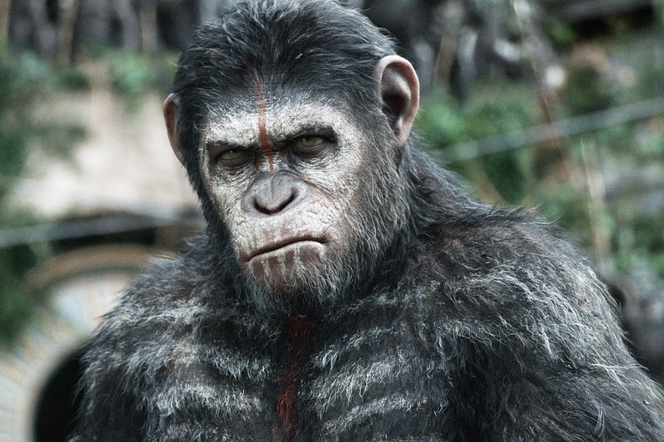
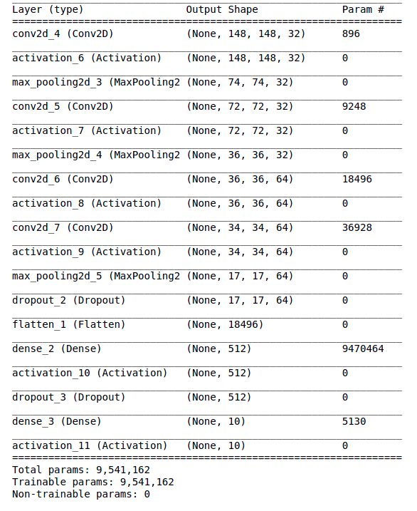
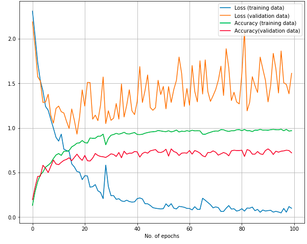
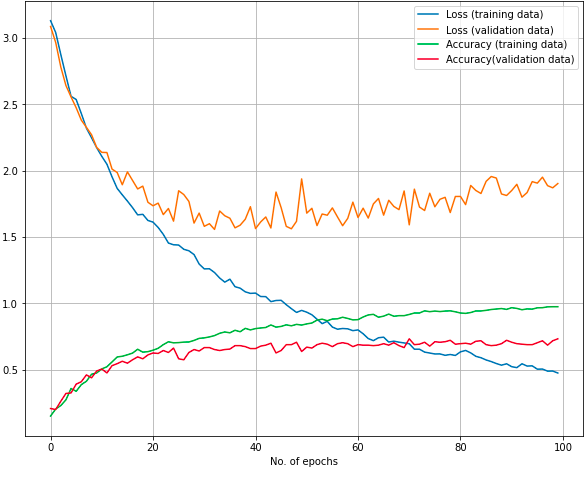
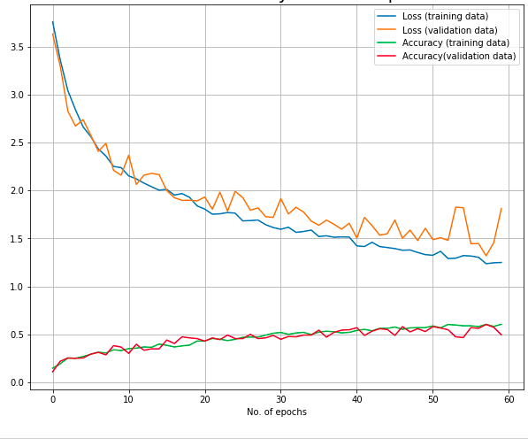
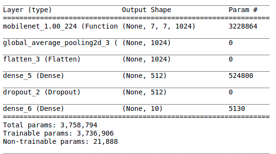
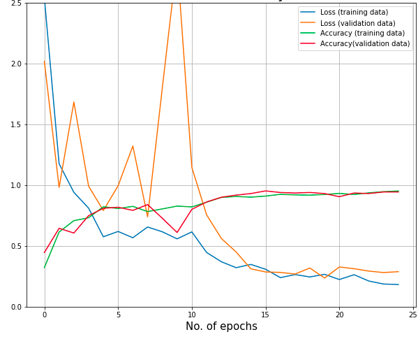

# CAN YOU NAME 3 MONKEY SPECIES?

## Introduction
Monkeys are often seen as being cute and highly intelligent animals. There are more than 260 different types of monkeys that have their own characteristics in terms of size, color, location, and even their abilities, But who can remember all 260 species? I can't. So, I decided to build a simple deep learning model from 10 different species that tells me what kind of monkey I am looking at. Purpose of this study is to gain insight into monkeys and appreciate humans' closest living relatives.

## Data
The data set, I have fed into my convolutional neural network came from kaggle (https://www.kaggle.com/slothkong/10-monkey-species). I just want to take a moment and thank all the people who has contributed to this dataset and making it more accessible.

## Workflow
### Let's start with my first model

  
  

I have used 4 convolutional layers and two dense layers in my first model and ran it for 100 epochs. Validation loss and training loss get diverged as the model continue to learn predicting training data. This is a sign of overfitting. After a certain point, model start getting good at predicting training data but not the validation data. Final test accuracy was at 72 after 100 epochs and quite promising. In the next model, I focus on regularizing my model to prevent overfitting. 

### Second model

  
  

I have reduced the learning rate from .001 to .0001, and included 0.001 of L2 normalization to the second from the last dense layer. I also add 2 more dense layers to make the model more flexible. After 30 epochs, I kind of end up getting the same result as validation accuracy wonders around 70's. Final test accuracy endup being 73. I have seen just a little progress in the second model, but I was not really happy with results I am getting.

### conclusion:
It seems like my model start overfitting after a certain number of epochs. I have regularized my model to be more flexible, but have not seen any progress. I was looking at what I can do next. First things, that came to mind was that I do not have enough data to deal with in the training dataset(100 images per species). Unfortunately, there was nothing I could do about that. Then, I went back to see my actual data, and found out that the data is not always about a picture of one monkey. Some pictures are about bunch of monkeys. Then, I start isolating pictures of one monkey.

### First model after modifying the data set

I ran the same model with my modified data set, and model stop learning after a certain number of epochs. Another disappointment. I kind of figure out why my training accuracy is not getting any better. One reason could be my model has found a local minima. I have some idea to deal with this problem like changing the learing rate. So, it can jump out of that hole and found the global minima. But I decided to not to give it a try since I do not have a lot training data to play with.

### Moving to transfer learning
At the end, I was left with transfer learning. My goal was to make a somewhat good model, that can predict a monkey species to a certain extent. I decided go  with transfer learning. All credit to MobileNet streamlined architecture making my life easier.

  
  

